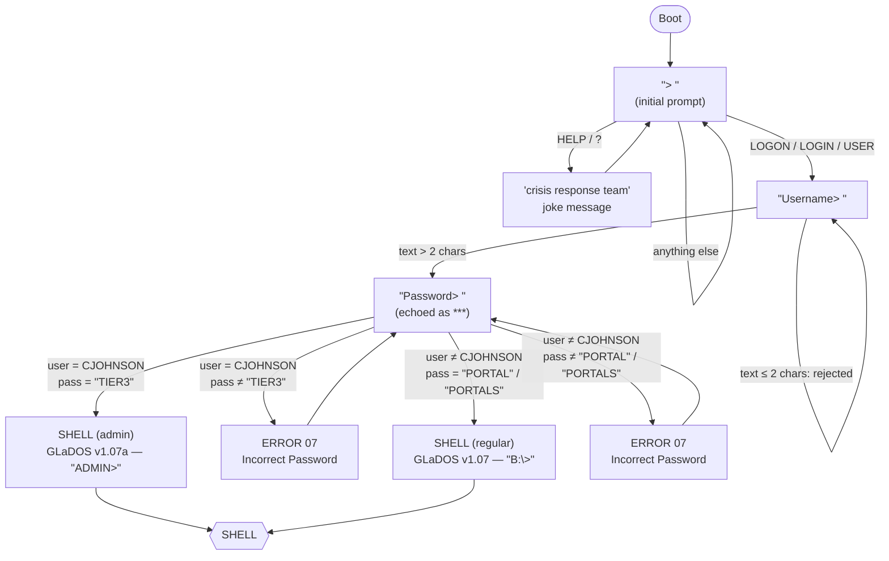
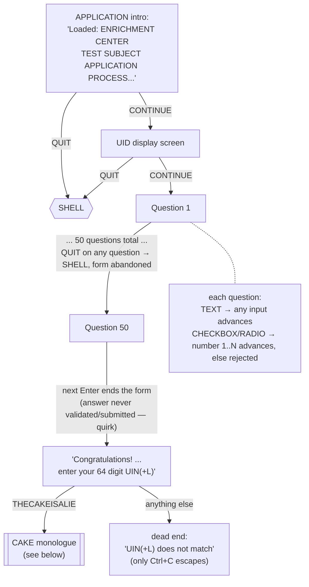
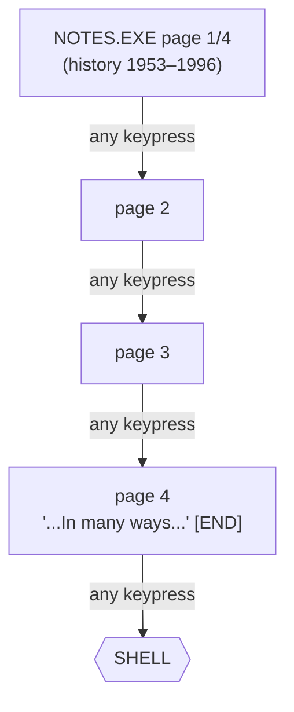
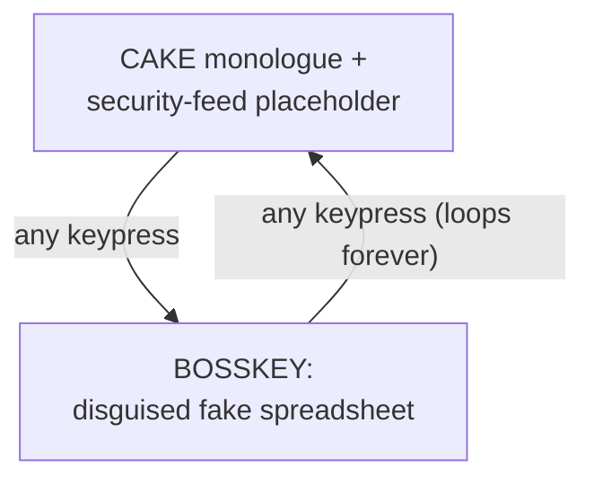

# Aperture Science Terminal (Kotlin port)

A Kotlin/JVM reimplementation of `ApertureScience17 (2007-10-17).swf`, the
fake DOS terminal from the 2007 *Portal* ARG site (aperturescience.com).

- Reproduces the login flow, the "GLaDOS" shell, the 50-question fake job
  application, the `CJOHNSON` admin account, `NOTES.EXE`, and the
  `THECAKEISALIE` easter egg.
- Runs in a real terminal — no Flash required.
- See [`../AGENTS.md`](../AGENTS.md) for how this was decompiled and ported,
  and for deliberate deviations from the original.

## Project structure

Five Gradle modules:

- **`logic/`** — the state machine (`TerminalEngine`). No UI framework
  dependency. Exposes a `StateFlow<String>` (current screen) and
  `fun onKeyEvent(key: String, ctrl: Boolean): Boolean`.
- **`ui-terminal/`** — Mosaic-based terminal UI. Depends on `logic`. Has the
  `main()` entry point and shadow-jar setup.
- **`ui-web/`** — browser/Compose-for-Web frontend. Depends on `logic`.
- **`ui-minitel/`** — Minitel/Vidéotex frontend, built on
  [minipavi-kotlin](https://github.com/outadoc/minipavi-kotlin). An embedded
  Ktor server speaking the [MiniPavi](https://www.minipavi.fr/) gateway
  protocol. See [Running `ui-minitel` locally](#running-ui-minitel-locally).
- **`ui-telnet/`** — telnet server frontend, built on
  [Ktor Network](https://ktor.io/docs/servers-raw-sockets.html)'s raw
  sockets. Depends on `logic`. One `TerminalEngine` per connection, same
  real-time keystroke feel as `ui-terminal` (live backspace, arrow-left nav,
  per-keystroke password masking) but reachable remotely by multiple
  concurrent telnet clients. See [Running `ui-telnet`
  locally](#running-ui-telnet-locally).

## Requirements

- JDK 21+
- A real interactive terminal ([Mosaic](https://github.com/JakeWharton/mosaic)
  needs a real TTY, not a pipe or redirected output)

## Build & run

```sh
./gradlew run
```

Or build a standalone fat jar:

```sh
./gradlew shadowJar
java -jar ui-terminal/build/libs/aperturescience-terminal-0.1.0-all.jar
```

`ui-terminal` takes over the whole terminal (alternate-screen buffer), like
`vim` or `htop`. Press **Ctrl+C** any time to exit — including from the
`THECAKEISALIE` loop, which has no other way back (matches the original).

## Testing

```sh
./gradlew :logic:test
```

- `logic` has a full unit test suite covering the whole state machine.
- Uses `kotlinx-coroutines-test` virtual time — no real TTY needed, runs in
  under a second (including the 50-question run-through and the
  2313-choice question's pagination).
- `ui-terminal` has no automated tests (needs a real terminal) — verify UI
  changes manually.

## Running `ui-minitel` locally

`ui-minitel` speaks HTTP to a MiniPavi gateway, which terminates the actual
Minitel/Vidéotex protocol. `ui-minitel/scripts/` sets up local instances of
both, mirroring [the same setup in
minipavi-kotlin](https://github.com/outadoc/minipavi-kotlin/tree/main/.docker):

- **`minipavi`** — PHP gateway, websocket on `:8182`, calls `ui-minitel` over
  HTTP.
- **`emulminitel`** — web-based Minitel emulator on `:8082`, connects to
  `minipavi`'s websocket.

To try it out:

1. Start `ui-minitel` (listens on `:8080`):
   ```sh
   ./gradlew :ui-minitel:run
   ```
2. In another terminal, start the gateway + emulator containers with
   [Podman](https://podman.io/) and open the emulator in a browser:
   ```sh
   ui-minitel/scripts/start.sh
   ```
   Stays attached, streaming both containers' logs. Ctrl+C stops it and the
   containers.
3. Tear everything down fully with `ui-minitel/scripts/stop.sh`.

## Running `ui-telnet` locally

```sh
./gradlew :ui-telnet:run
```

Listens on `:2323` (plain telnet has no encryption — don't expose this
directly to the internet without something like `stunnel` in front of it).
In another terminal:

```sh
telnet localhost 2323
```

Each connection gets its own session — feels just like running `ui-terminal`
locally (live backspace, arrow-left navigation, password masked as you type),
except multiple people can connect at once. `LOGOUT`/`PLAY PORTAL` closes the
connection cleanly; Ctrl+C disconnects immediately.

## Input rules

- Accepted: `0-9`, `A-Z` (auto-uppercased), space, `?`. Everything else is
  ignored.
- <kbd>Backspace</kbd> deletes the last character; <kbd>Enter</kbd> submits.
  Max input length: 65 characters.
- Commands are matched case-insensitively but must match **exactly** — no
  abbreviations, no partial matches.

## Command / state tree

Every screen and every input that moves between them. Error text is quoted
verbatim. Split by section — `SHELL` is the shared hub they return to.

### Boot & login



### Shell commands

From `SHELL` (`ADMIN>` for admin, `B:\>` for regular), every command below
returns straight back to it unless noted.

| Command                                                      | Result                                                     |
|--------------------------------------------------------------|------------------------------------------------------------|
| `DIR` / `CATALOG` / `DIRECTORY` / `LIST` / `LS` / `CAT`      | directory listing: `APPLY.EXE` (+ `NOTES.EXE` if admin)    |
| `IP`                                                         | prints `"uid:<session id>"`                                |
| `HELP` / `LIB` / `?`                                         | command list (+ `NOTES` if admin)                          |
| `APPEND` / `ATTRIB` / `COPY` / `FORMAT` / `ERASE` / `RENAME` | ERROR 15 — Disk is write protected                         |
| `PLAY` (no argument)                                         | ERROR 03 — What would you like to play?                    |
| `PLAY PORTAL`                                                | prints message, **exits program**                          |
| `PLAY <anything else>`                                       | no-op                                                      |
| `INTERROGATE` (no argument)                                  | ERROR 02 — Command requires at least one parameter         |
| `INTERROGATE` (as admin)                                     | ERROR 07 — Unknown Employee                                |
| `INTERROGATE` (as regular user)                              | ERROR 01 — Illegal attempt to initiate disciplinary action |
| `TAPEDISK`                                                   | ERROR 18 — User not authorized to transfer system tapes    |
| `NOTES` / `NOTES.EXE` (as admin)                             | opens [NOTES.EXE](#notesexe)                               |
| `NOTES` (as regular user)                                    | ERROR 24 — File 'NOTES' not found                          |
| `APPLY` / `APPLY.EXE`                                        | opens [APPLY.EXE](#applyexe)                               |
| `THECAKEISALIE`                                              | opens the [CAKE monologue](#cake-and-bosskey)              |
| `LOGOUT` / `BYE` / `LOGOFF` / `VALVE`                        | prints message, **exits program**                          |
| anything else                                                | ERROR 24 — File '<word>' not found                         |

### APPLY.EXE



### NOTES.EXE



### Cake and Bosskey



**Global, from any state:** <kbd>Ctrl+C</kbd> exits the program immediately.
