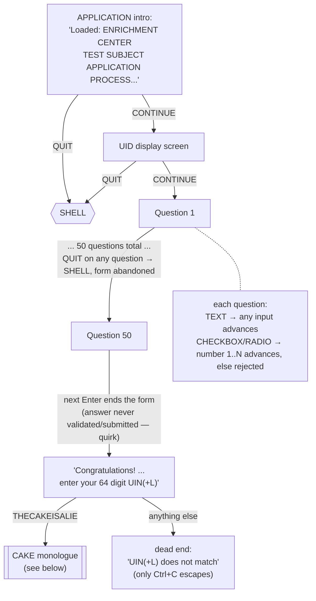
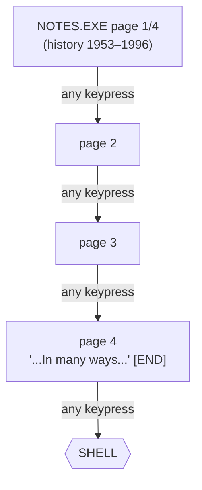
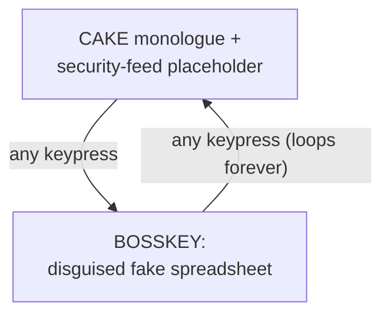

# Aperture Science Terminal (Kotlin port)

A Kotlin/JVM reimplementation of `ApertureScience17 (2007-10-17).swf`, the
fake DOS-style terminal from the 2007 *Portal* ARG viral-marketing site
(aperturescience.com). It reproduces the login flow, the "GLaDOS" shell,
the 50-question fake job application, the `CJOHNSON` admin account and its
`NOTES.EXE` corporate-history reader, and the `THECAKEISALIE` easter egg —
including its quirks — in a real terminal, no Flash required.

See [`../AGENTS.md`](../AGENTS.md) for how this was decompiled, extracted,
and ported, and for the list of deliberate deviations from the original.

## Project structure

Four Gradle modules:

- **`logic/`** — the whole state machine (`TerminalEngine`), with no
  dependency on Mosaic, Compose, or any other UI framework. Exposes a plain
  `StateFlow<String>` (the currently-displayed screen) and a
  `fun onKeyEvent(key: String, ctrl: Boolean): Boolean`.
- **`ui-terminal/`** — the Mosaic-based terminal UI (depends on `logic`).
  Collects the engine's `StateFlow` into a Compose `Text()` and forwards key
  events into it. This is the module with the `application`/shadow-jar setup
  and the `main()` entry point.
- **`ui-web/`** — a browser/Compose-for-Web frontend (depends on `logic`).
- **`ui-minitel/`** — a Minitel/Vidéotex frontend (depends on `logic`), built
  on [minipavi-kotlin](https://github.com/outadoc/minipavi-kotlin). It's an
  embedded Ktor server that speaks the [MiniPavi](https://www.minipavi.fr/)
  gateway protocol: MiniPavi calls it once per user action and it renders one
  Vidéotex frame in response. See [Running `ui-minitel`
  locally](#running-ui-minitel-locally) below for how to exercise it with a
  real (emulated) Minitel.

## Requirements

- JDK 21+
- A real interactive terminal (this uses [Mosaic](https://github.com/JakeWharton/mosaic),
  a Compose-for-terminal UI library, which needs a real TTY — it won't run
  under a plain pipe or redirected output)

## Build & run

```sh
./gradlew run
```

or build a standalone fat jar:

```sh
./gradlew shadowJar
java -jar ui-terminal/build/libs/aperturescience-terminal-0.1.0-all.jar
```

## Testing

`logic` has an automated unit test suite covering the whole state machine:

```sh
./gradlew :logic:test
```

No real TTY needed — it runs in well under a second using
`kotlinx-coroutines-test`'s virtual time, so even the 2313-choice question's
pagination and a full 50-question run-through execute instantly. `ui-terminal`
has no automated tests (Mosaic needs a real terminal); verify UI changes
manually as described above.

## Running `ui-minitel` locally

`ui-minitel` doesn't talk Vidéotex over a serial line to a real Minitel — it
speaks HTTP to a MiniPavi gateway, which is what actually terminates the
Minitel/videotex protocol (over a real modem, or over the
[websocket-based emulator](https://github.com/ludosevilla/minipavi/tree/master/emulminitel)
used here). `ui-minitel/scripts/` sets up local instances of both, mirroring
the [same setup in minipavi-kotlin](https://github.com/outadoc/minipavi-kotlin/tree/main/.docker):

- **`minipavi`** — the PHP gateway server, exposing a websocket on `:8182`
  and calling out to your locally-running `ui-minitel` over HTTP.
- **`emulminitel`** — a web-based Minitel emulator, served on `:8082`, that
  connects to `minipavi`'s websocket.

To try it out:

1. Start `ui-minitel` itself (it listens on `:8080`):
   ```sh
   ./gradlew :ui-minitel:run
   ```
2. In another terminal, build and start the gateway + emulator containers
   with [Podman](https://podman.io/), and open the emulator in a browser tab
   pointed at them:
   ```sh
   ui-minitel/scripts/start.sh
   ```
   This stays attached, streaming both containers' logs to stdout — handy
   for watching the requests MiniPavi sends to `ui-minitel` — until you stop
   it with Ctrl+C, which also stops the containers.

`ui-minitel/scripts/stop.sh` fully tears the containers and network back down.

The program takes over the whole terminal on launch, like `vim` or `htop`
(using the terminal's alternate-screen buffer) — whatever was on screen
before is hidden while it runs and comes back exactly as it was when it
exits.

Press **Ctrl+C** at any time to exit — including from the `THECAKEISALIE`
easter egg loop, which otherwise has no scripted way back to the shell (this
matches the original: your only real exit there was closing the browser tab).

## Input rules

- Accepted characters: `0-9`, `A-Z` (letters are upper-cased as you type,
  matching the original), space, and `?`. Everything else is ignored.
- <kbd>Backspace</kbd> deletes the last character; <kbd>Enter</kbd> submits
  the current line. Max input length is 65 characters.
- Commands are matched **case-insensitively as typed** but compared
  **exactly** — no abbreviations, no partial matches.

## Command / state tree

Every screen the terminal can show, and every input that moves you between
them. Error/rejection text is quoted verbatim. Split by section below so each
diagram stays readable — `SHELL` is the shared hub they all return to.

### Boot & login


### Shell commands

Once logged in, every command below is dispatched from the `SHELL` prompt
(`ADMIN>` for admin, `B:\>` for a regular user) and — unless noted — returns
straight back to it.

| Command                                                      | Result                                                     |
|--------------------------------------------------------------|------------------------------------------------------------|
| `DIR` / `CATALOG` / `DIRECTORY` / `LIST` / `LS` / `CAT`      | directory listing: `APPLY.EXE` (+ `NOTES.EXE` if admin)    |
| `IP`                                                         | prints `"uid:<session id>"`                                |
| `HELP` / `LIB` / `?`                                         | command list (+ `NOTES` if admin)                          |
| `APPEND` / `ATTRIB` / `COPY` / `FORMAT` / `ERASE` / `RENAME` | ERROR 15 — Disk is write protected                         |
| `PLAY` (no argument)                                         | ERROR 03 — What would you like to play?                    |
| `PLAY PORTAL`                                                | prints message, **exits program**                          |
| `PLAY <anything else>`                                       | no-op                                                      |
| `INTERROGATE` (no argument)                                  | ERROR 02 — Command requires at least one parameter         |
| `INTERROGATE` (as admin)                                     | ERROR 07 — Unknown Employee                                |
| `INTERROGATE` (as regular user)                              | ERROR 01 — Illegal attempt to initiate disciplinary action |
| `TAPEDISK`                                                   | ERROR 18 — User not authorized to transfer system tapes    |
| `NOTES` / `NOTES.EXE` (as admin)                             | opens [NOTES.EXE](#notesexe)                               |
| `NOTES` (as regular user)                                    | ERROR 24 — File 'NOTES' not found                          |
| `APPLY` / `APPLY.EXE`                                        | opens [APPLY.EXE](#applyexe)                               |
| `THECAKEISALIE`                                              | opens the [CAKE monologue](#cake-and-bosskey)              |
| `LOGOUT` / `BYE` / `LOGOFF` / `VALVE`                        | prints message, **exits program**                          |
| anything else                                                | ERROR 24 — File '<word>' not found                         |

### APPLY.EXE



### NOTES.EXE



### Cake and Bosskey



**Global, from any state:** <kbd>Ctrl+C</kbd> exits the program immediately.
